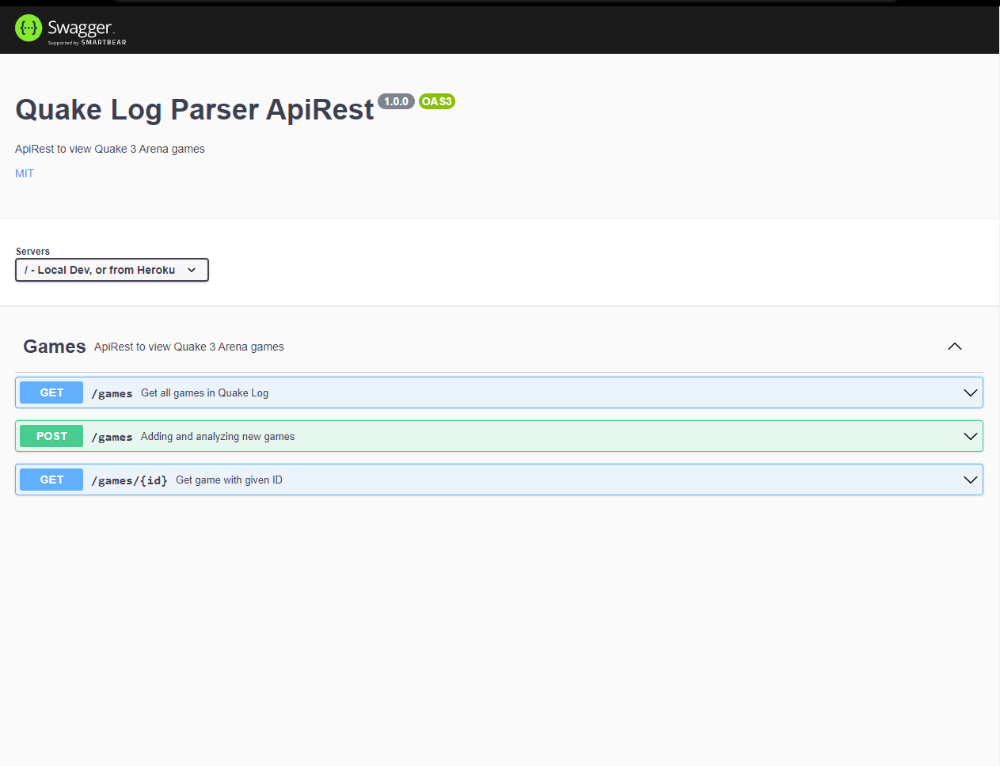
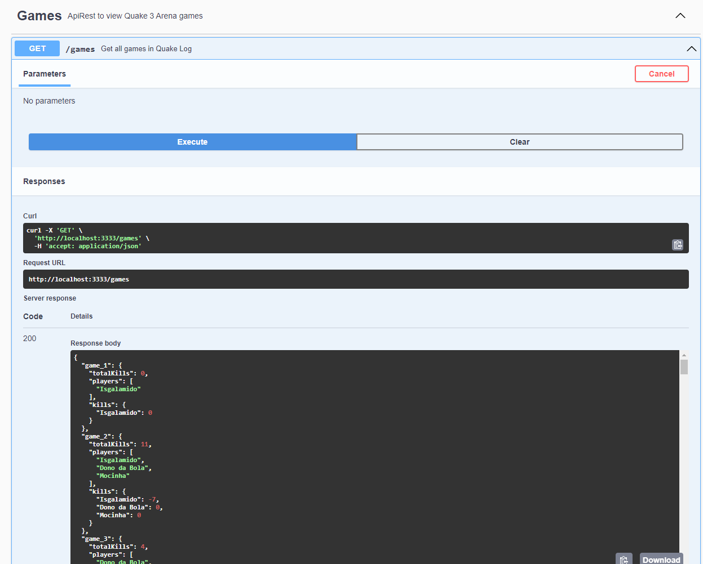
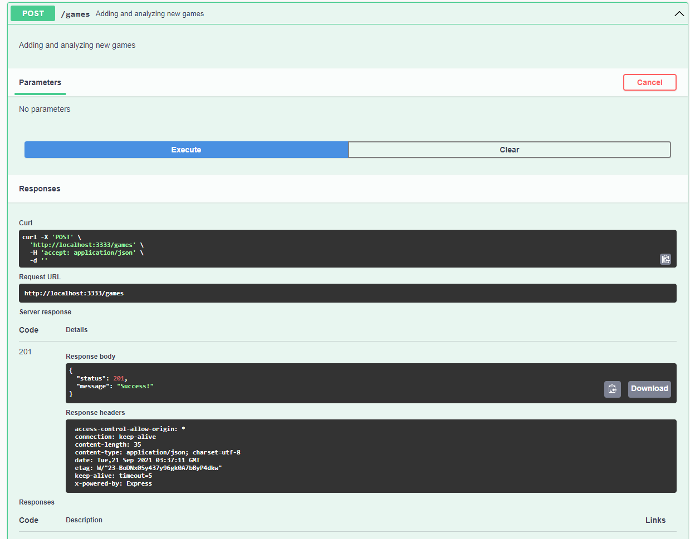
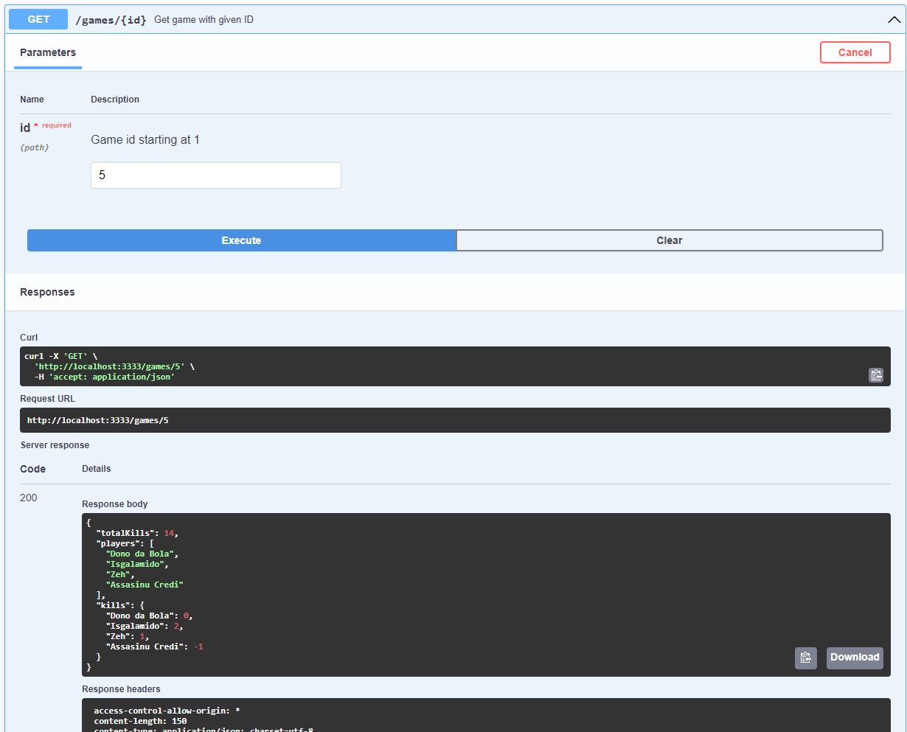
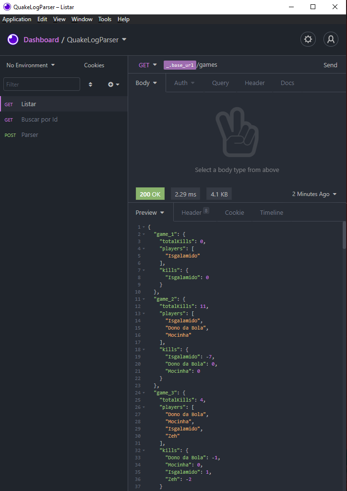
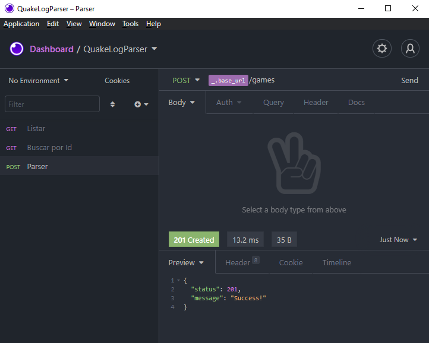
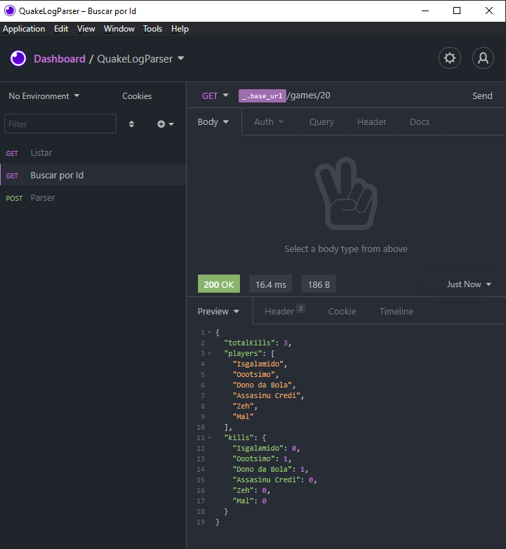
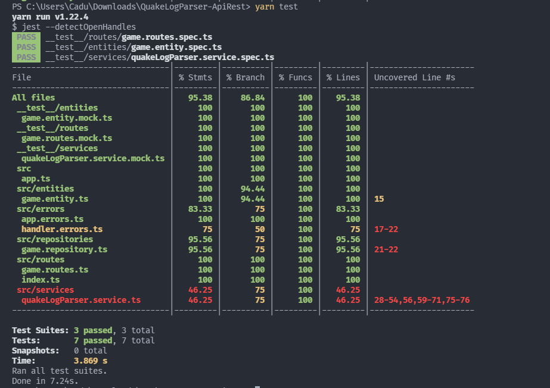

<div class="bg-gray-dark">
  <h1 align="center">
    Desafio Quake Log Parser
  </h1>
</div>

<p align="center">
  <a href="https://www.linkedin.com/in/carloseac/">
    
  </a>

  

  <a href="https://github.com/CarlosEduAC/QuakeLogParser-ApiRest/commits/main">
    
  </a>

  

  <a href="https://github.com/CarlosEduAC/QuakeLogParser-ApiRest/stargazers">
    
  </a>
</p>

<div align="center">
  <sub>Desafio Backend Luiza Labs. Construído por
    <a href="https://github.com/CarlosEduAC">Carlos Eduardo Cardoso</a>
  </sub>
</div>

## :pushpin: Tabela de Conteúdo

<!-- * [Site de Demostração](#eyes-site-de-demostração)  -->
* [Sobre](#one-sobre-o-projeto)
* [Tecnologias](#two-tecnologias)
* [Funcionalidades](#three-funcionalidades)
* [Como rodar](#construction_worker-como-rodar)
* [Licencia](#closed_book-licencia)

## :one: Sobre o Projeto


## :two: Tecnologias
Esse projeto foi feito utilizando as seguintes tecnologias:

* [Typescript](https://www.typescriptlang.org/)
* [NodeJS](https://nodejs.org/en/)
* [Express](https://expressjs.com/)
* [Swagger](https://swagger.io/)
* [Jest](https://jestjs.io/)

## :three: Funcionalidades

API REST para manter uma coleção de planetas do universo Star Wars. Dando a possibilidade de:

* Listar jogos
* Buscar por jogo
* Fazer Parser do QuakeLog

Para facilitar na visualização, desemvolvimento e documentação da API, foi utilizado
o [Swagger](https://swagger.io/).

### :camera: Swagger Screenshot
<div style="display: flex; flex-direction: 'row'; align-items: 'center';">
  
  
  
  
</div>

Uma outra opção é o [Insominia](https://insomnia.rest/), que diferente do [Swagger](https://swagger.io/) não necessita de nenhuma configuração no projeto para funcionar.

### :camera: Insominia Screenshot
<div style="display: flex; flex-direction: 'row'; align-items: 'center';">
  
  
  
</div>

## :four: Como rodar

### 📦 Rode a API

```bash
# Clone o Repositório
$ git clone https://github.com/CarlosEduAC/QuakeLogParser-ApiRest
```

```bash
# Vá para a pasta do servidor
$ cd QuakeLogParser-ApiRest

# Instale as dependências
$ yarn install

# Rode a aplicação
$ yarn start:dev
```
Acesse a API: http://localhost:3333/

### Testes

O Projeto conta com testes unitários.

```bash
# Rode os testes
$ yarn test
```

### :camera: Testes Screenshot
<div style="display: flex; flex-direction: 'row'; align-items: 'center';">
  
</div>

## :closed_book: Licencia

Lançado em 2021 :closed_book: Licencia

Construído por [Carlos Cardoso](https://github.com/CarlosEduAC) 🚀.
Esse projeto esta sobre [MIT license](./LICENSE).
